# NeoPixelPusher (NPP)
Control software for Adafruit NeoPixels.

* Simple serial protocol
* Effect Mode:
  * 58 built-in effects
  * 42 built-in color patterns
  * Custom effects possible, up to 96 frames on 4 channels
  * Custom color patterns possible, up to 32 colors
  * Variable speed control
  * Can randomly change modes periodically
* XLM (Explorateria Light Machine) Mode:
  * Simulates an exhibit at a certain San Francisco science museum
  * Perfect for NeoPixel Ring 60
* Clock Mode:
  * 3 display modes (point, line, binary)
  * Customizable colors for hours, minutes, seconds
  * Perfect for NeoPixel Ring 60
* Colors and fades are gamma-corrected
* Brightness adjustment
* Settings saved to EEPROM

## Default Configuration

* 60 NeoPixels on Pin 6
* "Factory reset" on Pin 5 (connect to ground to erase EEPROM on startup)
* RTC on SCL/SDA
* Can be modified at top of .ino file

## Serial Protocol

* `E` - Switch to Effect Mode
  * `ER` - Report whether randomization is in effect and time between effects
    * `ER0` - Do not randomly change effects
    * `ER1` - Randomly change effects
    * `ER` _ms_ - Set time between changing effects
  * `EM` - Report current effect (0-57, or 254 if custom)
    * `EM` _n_ - Set current effect
  * `ECP` - Report current color pattern preset (0-41, or 254 if custom)
    * `ECP` _n_ - Set current color pattern preset
  * `ECS` _rrggbb_ ... - Set custom color pattern (up to 4 colors initially)
  * `ECX` _rrggbb_ ... - Extend custom color pattern (up to 4 colors at a time, up to 32 at max)
  * `ECT` - Report number of colors
    * `ECT` _n_ - Report value of _n_-th color
  * `EBP` - Report current blink pattern present (0-17, or 254 if custom)
    * `EBP` _n_ - Set current blink pattern preset
  * `EBS` _ms_ _n_ _aabbccdd_ ... - Set custom effect / blink pattern
    * _ms_ - Milliseconds per frame, 2 hex digits
    * _n_ - Number of channels, 1 digit (1-4)
    * _aabbccdd_ - Brightness levels per channel, (2 * number of channels) hex digits
    * Up to 3 - 12 frames initially, depending on number of channels
  * `EBX` _aabbccdd_ ... - Extend custom effect / blink pattern
    * _aabbccdd_ - Brightness levels per channel, (2 * number of channels) hex digits
    * Up to 3 - 14 frames at a time, depending on number of channels
    * Up to 96 frames at max
  * `EBT` - Report milliseconds per frame, number of channels, and number of frames
    * `EBT` _n_ - Report brightness levels of _n_-th frame
  * `ES` - Report speed adjustment (0.0 to ~255.996 in increments of ~0.004)
    * `ES` _x_ - Set speed adjustment
* `X` - Switch to XLM (Explorateria Light Machine) Mode
    * `XN0+` - increase number on for first channel
    * `XN0-` - decrease number on for first channel
    * `XN1+` - increase number on for second channel
    * `XN1-` - decrease number on for second channel
    * `XO0+` - increase number off for first channel
    * `XO0-` - decrease number off for first channel
    * `XO1+` - increase number off for second channel
    * `XO1-` - decrease number off for second channel
    * `XS0+` - increase speed of first channel
    * `XS0-` - decrease speed of first channel
    * `XS1+` - increase speed of second channel
    * `XS1-` - decrease speed of second channel
    * `XV0` - reverse first channel
    * `XV1` - reverse second channel
    * `XR0` - start / resume first channel
    * `XR1` - start / resume second channel
    * `XF0` - stop / freeze first channel
    * `XF1` - stop / freeze second channel
    * `XZ0` - reset first channel to default
    * `XZ1` - reset second channel to default
* `C` - Switch to Clock Mode
  * `CCH` _rrggbb_ - Set hour color
  * `CCM` _rrggbb_ - Set minute color
  * `CCS` _rrggbb_ - Set second color
  * `CM` _n_ - Set clock mode
    * `CM0` - Point mode
    * `CM1` - Line mode
    * `CM2` - Binary mode
  * `CS` _yyyymmdd_ _hhmmss_ - Set clock time
  * `CT` - Report clock time
* `PB` _n_ - Set brightness level (0-255)
* `PZ` - Report free RAM

## Effect Modes

* 0 - Steady On\
  
* 1 - Scroll Left\
  
* 2 - Scroll Right\
  
* 3 - Blink\
  
* 4 - Cycle\
  
* 5 - Cycle On/Off\
  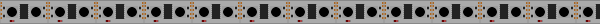
* 6 - Color Wipe\
  
* 7 - Color Wipe On/Off\
  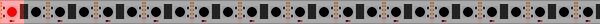
* 8 - Fast Fade In/Out\
  
* 9 - Fast Fade Cycle\
  
* 10 - Fast Fade Cycle In/Out\
  
* 11 - Slow Fade In/Out\
  
* 12 - Slow Fade Cycle\
  
* 13 - Slow Fade Cycle In/Out\
  
* 14 - Walk Left\
  
* 15 - Walk Right\
  
* 16 - Walk Left/Right\
  
* 17 - Move Left\
  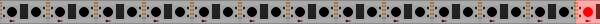
* 18 - Move Right\
  
* 19 - Oscillate\
  
* 20 - Running Lights A Left\
  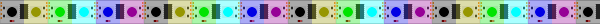
* 21 - Running Lights A Right\
  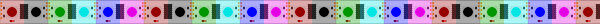
* 22 - Running Lights B Left\
  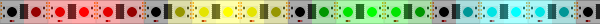
* 23 - Running Lights B Right\
  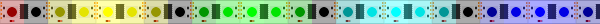
* 24 - Twinkle
* 25 - Random Twinkle
* 26 - Endless Twinkle
* 27 - Moodlight
* 28 - Sparkle
* 29 - Random Sparkle
* 30 - Snow Sparkle
* 31 - Static
* 32 - Tail Chase Left
* 33 - Tail Chase Right
* 34 - Larson Scanner A
* 35 - Larson Scanner B
* 36 - Bouncing Balls A
* 37 - Bouncing Balls B
* 38 - Fire
* 39 - Meteor Rain
* 40 - Chase 1/2\
  
* 41 - Chase 1/3\
  
* 42 - Chase 1/4\
  
* 43 - Chase 2/3\
  
* 44 - Chase 2/4\
  
* 45 - Chase 3/4\
  
* 46 - Slo Glo 3\
  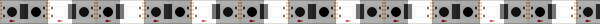
* 47 - Slo Glo 4\
  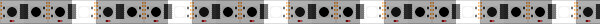
* 48 - Waves 3\
  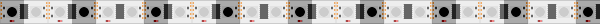
* 49 - Waves 4\
  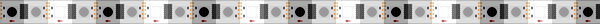
* 50 - Twinkle Flash A\
  
* 51 - Twinkle Flash B\
  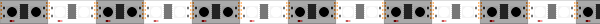
* 52 - Twinkle Flash C\
  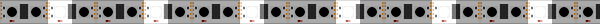
* 53 - Chasing Flash\
  
* 54 - Walk 3\
  
* 55 - Walk 4\
  
* 56 - Oscillate 3\
  
* 57 - Oscillate 4\
  

## Color Patterns

* 0 - Bright White\
  
* 1 - Warm White\
  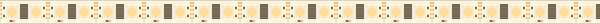
* 2 - Azure\
  
* 3 - Multicolor Mini (Red, Blue, Green, Magenta, Gold)\
  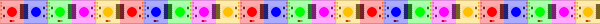
* 4 - Multicolor Solid (Red, Blue, White, Orange, Green)\
  
* 5 - Multicolor Translucent (Red, Blue, Green, Yellow, Magenta)\
  
* 6 - Rainbow (Red, Orange, Yellow, Green, Cyan, Blue, Violet, Magenta)\
  
* 7 - Pastel Rainbow\
  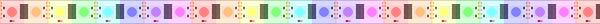
* 8 - Red & White\
  
* 9 - Red & Green\
  
* 10 - Blue & White\
  
* 11 - Blue & Green\
  
* 12 - Autumn Colors (Brown, Red, Orange, Yellow)\
  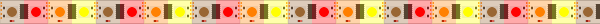
* 13 - Orange\
  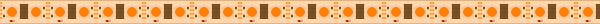
* 14 - Summer Colors (Yellows)\
  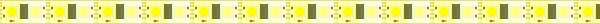
* 15 - Red White & Blue\
  
* 16 - Spring Colors (Yellows & Greens)\
  
* 17 - Valentines (Reds & Pinks)\
  
* 18 - Winter Colors (Cyans & Blues)\
  
* 19 - Purples\
  
* 20 - Rainbow Deluxe\
  
* 21 - Assorted Pastels\
  
* 22 - Red, Yellow, Blue, Green\
  
* 23 - Orange, Magenta, Yellow\
  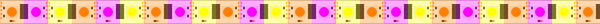
* 24 - Magenta, Yellow\
  
* 25 - Red\
  
* 26 - Gold\
  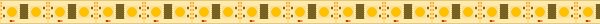
* 27 - Green\
  
* 28 - Blue\
  
* 29 - Red & Blue\
  
* 30 - Barber Pole (Red, White, Blue, White)\
  
* 31 - Red White & Green\
  
* 32 - Assorted Colors 1\
  
* 33 - Assorted Colors 2\
  
* 34 - Purple, Indigo, Magenta\
  
* 35 - Pink, Magenta, Cyan\
  
* 36 - Red, Orange, Yellow, Green, Blue, Violet\
  
* 37 - Orange, Yellow, Green\
  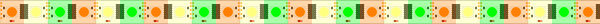
* 38 - White, Violet, Azure\
  
* 39 - Yellow, Pink, Aquamarine\
  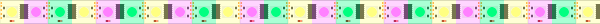
* 40 - Pastel Pink, Orange, Yellow, White, Cyan, Purple\
  
* 41 - Cyan, Azure, Purple, Pink, Orange, Yellow, Green\
  
